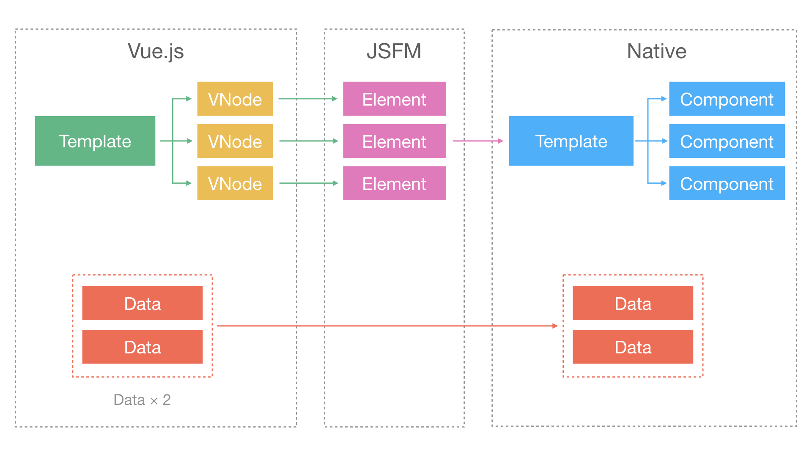
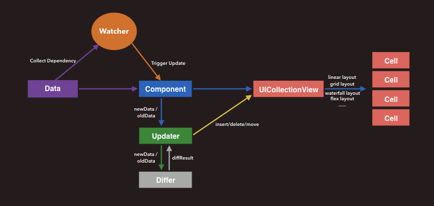
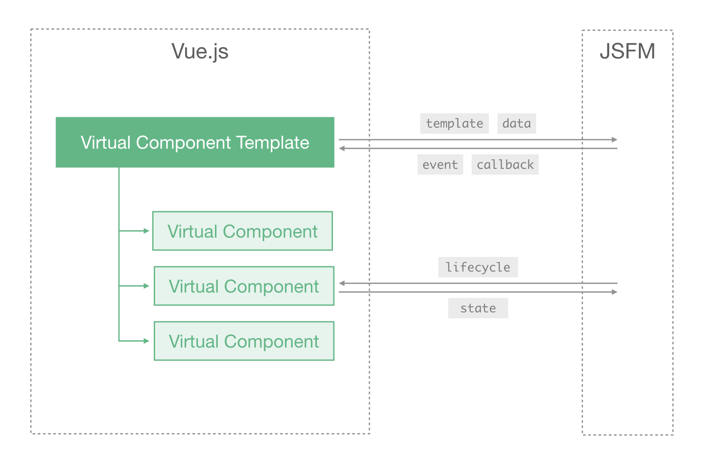

[Proposal](https://github.com/Hanks10100/incubator-weex/issues/1)

# 长列表的复用方案

## 需求背景

+ 长列表（无限列表）在移动端很常见，会消耗大量渲染时间和内存，通常是性能瓶颈。
+ 虽然列表中的内容很长，但是结构都比较相似，只是内容有差异，很适合复用。
+ 长列表中有大量节点不在可视区，回收并复用这些节点可以减少内存占用和创建新节点时的开销。

在列表变得特别长的时候，尤其是列表包含了大量图文视频的时候，即使做了懒加载优化了渲染效率，超长列表内存的占用量也很难优化。

如果能复用列表中相似的模板结构，由数据来驱动原生组件的渲染，节点离屏之后将模板回收，将会大幅优化长列表的渲染性能和内存使用量。

## 整体设计方案

设计思路：

+ 前端框架中不将长列表展开，而是将列表数据和模板发送到客户端。
+ 客户端根据数据和模板渲染生成列表，并且实现节点的回收和复用。
+ 前端框架管理组件的私有状态，并将状态同步给客户端。

更强调【数据驱动】和【声明式】的开发方式。

## 常规组件的渲染

首先分析一下目前在 Weex 里常规组件的渲染流程是怎样的。

在 Weex 的架构中，可以简略的分成三层：【DSL】->【JS Framework】->【原生渲染引擎】。其中 DSL (Domain Specific Language) 指的是 Weex 里支持的上层前端框架，即 Vue 和 Rax。原生渲染引擎就是在 Weex 支持的平台上（Android 或 iOS）绘制原生 UI 的引擎。JS Framework 是桥接并适配 DSL 和原生渲染引擎的一层。

常规组件的渲染过程可以分为如下这几个步骤：

1. 创建前端组件
2. 生成 Virtual DOM
3. 生成“真实” DOM
4. 发送渲染指令
5. 绘制原生 UI

可以用下面这一张图来概括：

> 图中的 JSFM 为 JS Framework 的简写。

下面以 Vue.js 为例，详细介绍一下常规组件的渲染过程。

### 创建前端组件

Vue 框架使用组件化的开发方式构建页面，整个页面可以划分成多个层层嵌套和平铺的组件。Vue 框架在执行渲染前，会先根据开发时编写的模板创建相应的组件实例，可以称为 Vue Component，它包含了组件的内部数据、生命周期以及 `render` 函数等。

如果给同一个模板传入多条数据，就会生成多个组件实例，这可以算是组件的复用。如上图所示，假如有一个组件模板和两条数据，渲染时会创建两个 Vue Component 的实例，每个组件实例的内部状态是不一样的。

### 生成 Virtual DOM

Vue Component 的渲染过程，可以简单理解为组件实例执行 `render` 函数生成 `VNode` 节点树的过程，也就是构建 Virtual DOM 的生成过程。自定义的组件在这个过程中被展开成了平台支持的节点，例如图中的 `VNode` 节点都是和平台提供的原生节点一一对应的，它的类型必须在 [Weex 支持的原生组件](http://weex-project.io/references/components/index.html)范围内。

`VNode` 中其实也包含了归属组件的信息，但是想要从 `VNode` 节点树反推出组件的模板结构非常难，也无法保证完备性。

### 生成“真实” DOM

以上过程在 Weex 和浏览器里都是完全一样的，从生成真实 DOM 这一步开始，Weex 使用了不同的渲染方式。

在 Weex 的 JS Framework 中提供了和 DOM 接口类似的 Weex DOM API，Vue 使用这些接口将 `VNode` 渲染生成适用于 Weex 平台的 `Element` 对象。过程和浏览器类似，但是调用的接口不一样，生成的 `Element` 的结构也不一样。这个过程基本上都是 O(1) 的操作，`VNode` 和 `Element` 都是一一对应的。

生成了 `Element` 之后节点的结构就变得非常简单了，`VNode` 中包含的数据、组件信息都被移除掉了，想从 `Element` 反推出自定义组件的模板结构是不可能的了。

### 发送渲染指令

在 JS Framework 内部，会将自己构建的 Element 节点树以渲染指令的形式发给客户端。

### 绘制原生 UI

客户端接收 JS Framework 发送的渲染指令，创建相应的原生组件，最终调用系统提供的接口绘制原生 UI。这个过程中某些组件会自带一部分回收和复用的功能，例如 `list` 组件会回收离屏 View 的内存，但是上图中 Weex Component 这部分并不会回收，可复用程度有限。

## 可复用组件的渲染

回顾上述过程可以看出，组件的模板结构是可复用的，这也是组件化的优势之一，但是组件的展开发生在前端框架内部，在传递到客户端的过程中，节点的结构保留了，但是组件的信息都被过滤掉了。即使同一个组件使用两份数据来渲染，生成了两份结构一致只有小部分内容有差异的节点，客户端也不会认为他们之间有联系，依然彼此独立的渲染。

也就是说，在常规组件的渲染流程中，客户端感知不到前端组件的概念，渲染粒度太小，难以复用。要想实现模板的复用，就得把模板和数据发给客户端，由客户端来实现模板的渲染。

### 把数据和模板发给客户端

要想实现客户端渲染模板，就不能在前端框架中将模板展开，列表数据就不在前端框架中处理了，而是直接发给客户端。

如上图所示，前端框架中的 `Template` 不再需要数据，而是直接展开成一种纯静态的模板结构，结构中包含了模板渲染逻辑，格式仍然是 `VNode`。然后经过 JS Framework 转换成 Weex 支持的 `Element`，其中也包含了模板的原生渲染指令。客户端解析出可复用的模板结构，由数据驱动模板渲染，这个模板结构和前端组件中的定义是一致的。

这个过程除了要把模板发给客户端，还得带上模板的渲染逻辑，告诉客户端如何根据数据来渲染模板。为了描述这些渲染逻辑，就得设计一套面向原生渲染引擎的模板渲染指令。

### 自定义原生模板指令

以 Vue 为例，它提供了[单文件组件](https://cn.vuejs.org/v2/guide/single-file-components.html)的语法，其中 `v-bind` 、 `v-for` 、 `v-if` 之类的指令，以及 `{{}}` 中的数据绑定都是描述渲染逻辑的，这些逻辑也不能在前端里展开，而是转换成特殊的格式发给客户端来处理。这种特殊格式可以称为 Weex 自定义的一套原生指令（Weex Native Directive）。这层指令是面向客户端的渲染行为设计的，是原生渲染器和 JS Framework 之间的约定，可以对接到 Vue 和 Rax 等多个上层框架，语法基本上都是一一对应的。具体的语法规则，可以参考 [Implementation.md#模板语法](./Implementation.md#%E6%A8%A1%E6%9D%BF%E8%AF%AD%E6%B3%95)。

> Vue 里的渲染逻辑是声明式的写在模板里的，因此可以很容易的编译成 Weex 自定的原生指令，整个转换过程可以融入到现有的编译工具中处理，对上层开发者透明，基本上对开发过程无影响，也不影响原有功能。 Rax/React 的标签语法可以使用 JSX 编写，但是模板的渲染规则（循环和条件）仍然由 JS 脚本来控制，很难编译成静态的描述，要想使用长列表的复用功能，需要对开发时的写法做特殊约定。

### 客户端根据数据渲染模板

客户端拿到了数据和模板以后，在内部建立起 Watcher 和 Updater 的更新机制，由数据驱动模板的渲染。在最初渲染时只渲染屏幕内呈现出来的节点。

当列表向下滚动时，回收掉上方不在屏幕内的模板，并不销毁而是将其中的数据清空。当列表下方需要渲染新的数据时，会取出回收的空模板，注入数据渲染出真实节点，然后追加到列表下方。列表向上滚动时的原理是一样的，为了保障列表滚动的流畅，也会渲染屏幕上下方扩展区域内的节点。

无论真实的数据有多少条，真实渲染的只有可滚动区域内的节点，这样不仅可以加快首屏的渲染速度，内存的占用量也不会随着列表长度大幅增长。

### 使用 Virtual Component 管理组件状态（待补充）

客户端只根据模板和数据就能渲染出来节点，看起来必须要得函数式组件才可以做到，也就是要求组件必须是不含内部状态的，然而实际应用中绝大多数组件都含有内部状态的。

对于包含了状态的组件，渲染过程就比较复杂了，因为内部状态的处理逻辑（`data`,`watch`, `computed`）都在前端中，然而模板和数据都已经发给客户端处理了，所以需要经过多个回合的通信来解决状态同步问题。

+ Virtual Component Template 只有模板节点，没有状态也没生命周期，不执行 render 也不 update，监听事件。
+ Virtual Component 不执行 render 也没有节点，有状态有生命周期，数据更新不触发渲染而是发给客户端。

## 特性分析

分析优缺点，待补充。
