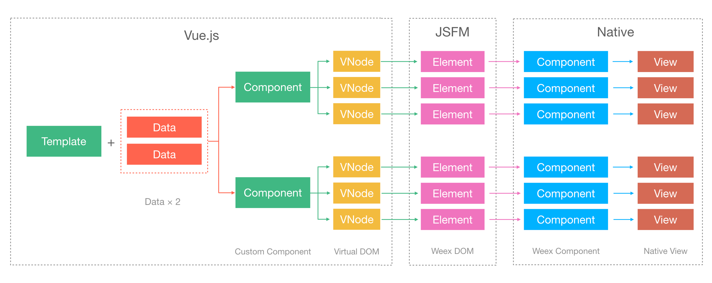

[Proposal](https://github.com/Hanks10100/incubator-weex/issues/1)

# 长列表的复用方案

## 需求背景

+ 长列表（无限列表）在移动端很常见，会消耗大量渲染时间和内存，通常是性能瓶颈。
+ 长列表中有大量节点不在可视区，回收并复用这些节点可以减少内存占用和创建新列表时的开销。
+ 在 Weex 场景下，列表的渲染由前端框架实现，原生端无法介入此渲染过程，很难实现复用。

为了提升渲染性能，可以考虑提供新的渲染长列表的方式，最大化地复用节点。

## 整体设计方案

设计思路：

+ 前端框架中不将长列表展开，而是将列表数据和模板发送到客户端。
+ 客户端根据数据和模板渲染生成列表，并且实现节点的回收和复用。
+ 前端框架管理组件的私有状态，并将状态同步给客户端。

更强调【数据驱动】和【声明式】的开发方式。

## 常规组件的渲染

首先分析一下目前在 Weex 里常规组件的渲染流程是怎样的。

在 Weex 的架构中，可以简略的分成三层：【DSL】->【JS Framework】->【原生渲染引擎】。其中 DSL (Domain Specific Language) 指的是 Weex 里支持的上层前端框架，即 Vue 和 Rax。原生渲染引擎就是在 Weex 支持的平台上（Android 或 iOS）绘制原生 UI 的引擎。JS Framework 是桥接并适配 DSL 和原生渲染引擎的一层。

常规组件的渲染过程可以分为如下这几个步骤：

1. 创建前端组件
2. 生成 Virtual DOM
3. 生成“真实” DOM
4. 发送渲染指令
5. 绘制原生 UI

可以用下面这一张图来概括：



> 图中的 JSFM 为 JS Framework 的简写。

下面以 Vue.js 为例，详细介绍一下常规组件的渲染过程。

### 创建前端组件

Vue 框架使用组件化的开发方式构建页面，整个页面可以划分成多个层层嵌套和平铺的组件。在真正执行渲染前，会先根据开发时编写的模板创建相应的组件实例，可以称为 Vue Component，它包含了组件的内部数据、生命周期以及 `render` 函数等。

如果给同一个模板传入多条数据，就会生成多个组件实例，这可以算是组件的复用。如上图所示，假如有一个组件模板和两条数据，渲染时会创建两个 Vue Component 的实例，每个组件实例的内部状态可能是不一样的。

### 生成 Virtual DOM

Vue Component 的渲染过程，可以简单理解为组件实例执行 `render` 函数生成 `VNode` 节点树的过程，也就是 Virtual DOM 的生成过程。

组件在这个过程中被展开成了节点，组件的名称可以是用户自定义的，包含了页面逻辑，但是 Virtual DOM 中的节点都是和平台提供的原生节点一一对应的。例如一个自定义的 `Panel` 组件，展开成了三个 `<div>` 和两个 `<text>`，div 和 text 就是 Weex 平台提供原生节点。

### 生成“真实” DOM

以上过程在 Weex 和 Web 里都是完全一样的，从这里开始 Weex 使用了不同的渲染方式。

### 发送渲染指令

### 绘制原生 UI

## 改造思路

对渲染行为的改造关键在于【复用】这个词。

从上边的过程可以看出，要想实现复用，就必须直接把模板结构发送给客户端。一旦模板在前端中展开，就无法逆向解析出原有的模板结构。

### 将组件的渲染过程交给客户端

> 类似于函数式运算的惰性求值。

```js
const component = data => render(data) // 定义组件
const vdom = component(data) // 生成 Virtual DOM
const element = patch(vdom) // 生成真实 DOM
send(element) // 把元素节点发送给客户端
draw(element) // 客户端渲染元素节点
```

```js
const template = data => specialRender(data) //
send(template, data)
draw(template, data)
```

并不是把 JS 函数发给客户端，而是将“渲染过程”发给客户端。具体来讲，就是把模板里的渲染指令和数据绑定编译成纯静态结构，原样发给客户端。

### 自定义原生模板指令

以 Vue 为例，在模板语法中 `v-bind` 、 `v-for` 、 `v-if` 之类的指令，以及 `{{}}` 中的数据绑定将会编译成 Weex 自定义的一套原生指令（Weex Native Directive）。这层指令是面向客户端的渲染行为设计的，是原生渲染器和 JS Framework 之间的约定，可以对接到 Vue 和 Rax 等多个上层框架，语法基本上都是一一对应的。具体的语法规则，可以参考 [Implementation.md#模板语法](./Implementation.md#%E6%A8%A1%E6%9D%BF%E8%AF%AD%E6%B3%95)。

Vue 本身提供了[单文件组件](https://cn.vuejs.org/v2/guide/single-file-components.html)的语法，从源码到目标文件有一个编译过程，上述提到的模板规则可以融入到这个编译过程中处理，整个转换过程对上层开发者透明，只需要改造编译工具，传递特殊的编译选项，即可生成新的模板语法，基本上对开发过程无影响，也不影响原有功能。 Rax/React 的标签语法可以使用 JSX 编写，但是模板的渲染规则（循环和条件）仍然由 JS 脚本来控制，很难编译成静态的描述，要想使用长列表的复用功能，需要对开发时的写法做特殊约定。

### 使用 Virtual Component 管理组件状态

客户端要想根据 template + data 就能渲染出来节点，看起来必须要得函数式组件才可以做到，那如何渲染包含私有状态的组件呢？

## 可复用组件的渲染


组件不在前端展开，而是把模板和数据发给客户端。

## 前端的改造


+ Virtual Component Template 只有模板节点，没有状态也没生命周期，不执行 render 也不 update，监听事件。
+ Virtual Component 不执行 render 也没有节点，有状态有生命周期，数据更新不触发渲染而是发给客户端。

## 客户端的改造


## 特性分析

分析优缺点，待补充。
