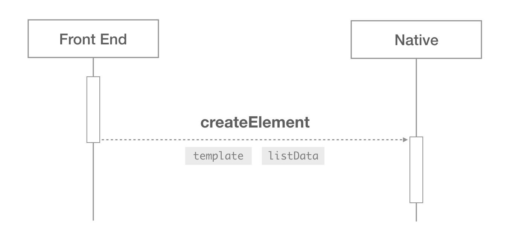
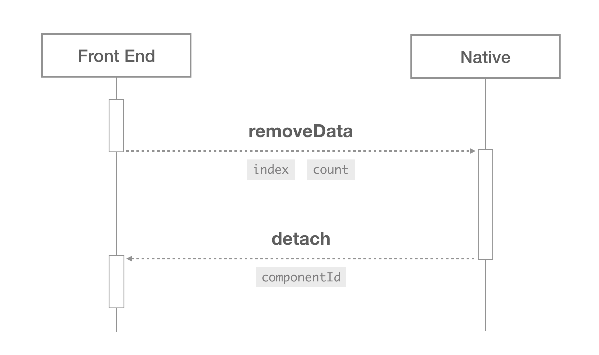

# 实现细节

## 模板语法

+ 数据绑定： `@binding`
+ 事件绑定： `{ type, params }`
+ 控制指令： `[[match]]`, `[[repeat]]`
+ 组件声明： `@isComponentRoot`, `@templateId`, `componentProps`

### 模板绑定
### 事件绑定

```js
{
  type: 'div',
  event: [{
    type: 'click',
    params: [{ '@binding': 'expression' }]
  }]
}
```

### 控制指令

```js
{
  type: 'div',
  attr: {
    '[[match]]': 'expression'
    }
  }
}
```

```js
{
  type: 'div',
  attr: {
    '[[repeat]]': {
      '@expression': 'listData',
      '@alias': 'item',
      '@index': 'i',
      // '@key': 'key'
    }
  }
}
```

### 组件声明

```js
{
  type: 'div',
  attr: {
    '@isComponentRoot': true,
    '@templateId': 'virtual-component-template-1',
    '@isComponentRoot': {
      whatever: { '@binding': 'expression' }
    }
  }
}
```

## 渲染过程

取值作用域



### 渲染子组件

在渲染过程中，如果遇到某个节点包含了 `@isComponentRoot` 属性，则将当前节点及其后代节点视为一个组件。


0. 首先在客户端中生成一个全局唯一的 `componentId`，作为组件的唯一标识符。
0. 计算 `@componentProps` 中定义的绑定信息，生成 `propsData`。
0. 通过 componentHook 派发 `create` 的钩子，将 `componentId` 和 `propsData` 发送给前端。
0. 前端中以 `componentId` 和 `propsData` 创建 Virtual Component，并将组件的初始状态 `initialState` 返回给客户端。
0. 客户端使用 `initialState` 渲染当前组件中的模板。

如果渲染组件的过程中，又遇到了包含 `@isComponentRoot` 的节点，则重复上述过程。

## 响应事件


当在某个节点上捕获到事件时，

0. 首先找到节点对应的 `componentId`，如果
  + 找到了，则向事件对象 `event` 中添加该属性。然后检测事件的绑定信息中是否包含 `params`，如果
    + 包含，则计算出绑定的值，在 fireEvent 的时候一起发送给前端。
    + 不包含则忽略。
  + 没找到则忽略。
0. 最后走正常的事件派发流程即可。

## 数据更新

+ updateData
+ appendRange
+ insertRange
+ removeData

### 创建新组件

整个过程和渲染子组件的过程是一样的。也是重新生成 `componentId` 并计算 `propsData`，然后通过 `create` 的钩子发给前端。前端返回 `initialState`，然后用这个数据渲染组件中的模板。

### 更新组件

在更新列表数据时，如果遇到了组件。


0. 先根据 `@componentProps` 中的绑定信息计算出 `newPropsData`。
0. 将 `newPropsData` 和最初生成的 `propsData` 做对比。
0. 如果存在差异，则将差异数据和 `componentId` 一起通过 `syncState` 的钩子发送给前端。
0. 前端框架中重新计算当前组件的状态，然后将新状态 `newState` 返回给客户端。
0. 客户端根据 `newState` 渲染组件中的模板，并且用 `newPropsData` 替换旧的 `propsData`。
0. 真实节点渲染完成后，通过 componentHook 向前端派发 `update` 的钩子。

### 移除组件



如果数据变更，导致某个节点被移除掉了，应当检测被移除掉的节点中是否包含组件（是否包含 `@isComponentRoot`），如果包含组件

+ 找到被移除节点对应的 `componentId`。
+ 通过 componentHook 向前端派发 `detach` 的钩子，把 `componentId` 发送给前端。

## 主动更新组件数据


当前端中 Virtual Component 的状态发生变化之后，会主动触发数据的更新。

0. 使用 `updateComponentData` 方法将 `componentId` 和 `newState` 发送给客户端。
0. 客户端根据 `componentId` 找到相应的组件，使用 `newState` 重新渲染组件中的模板。
0. 真实节点渲染完成后，通过 componentHook 向前端派发 `update` 的钩子。

## 模板更新
