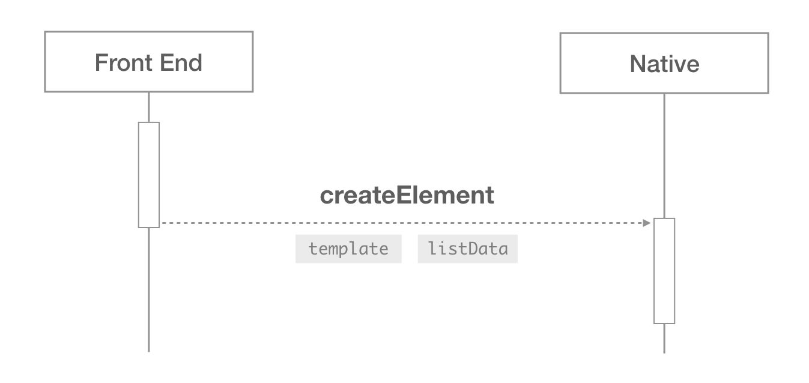
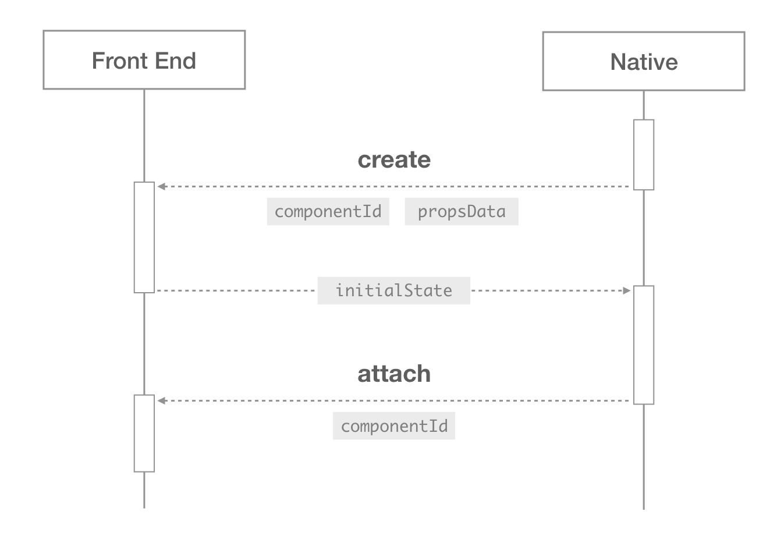
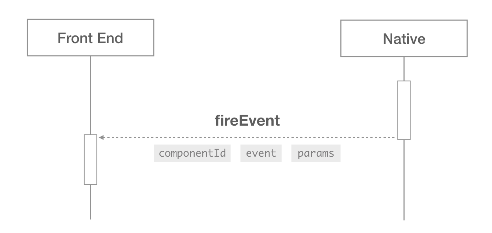
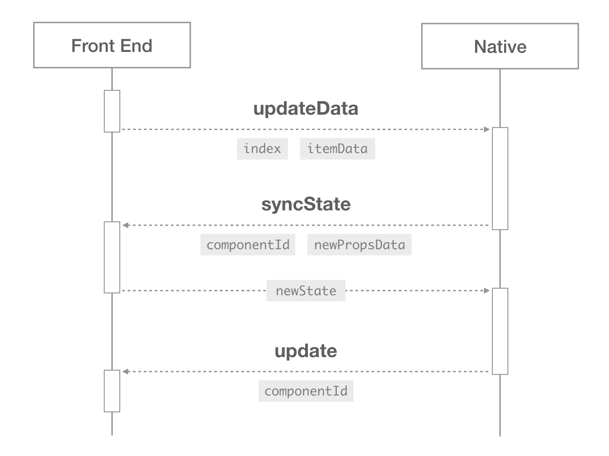
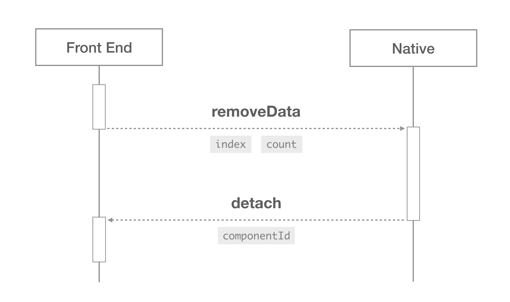
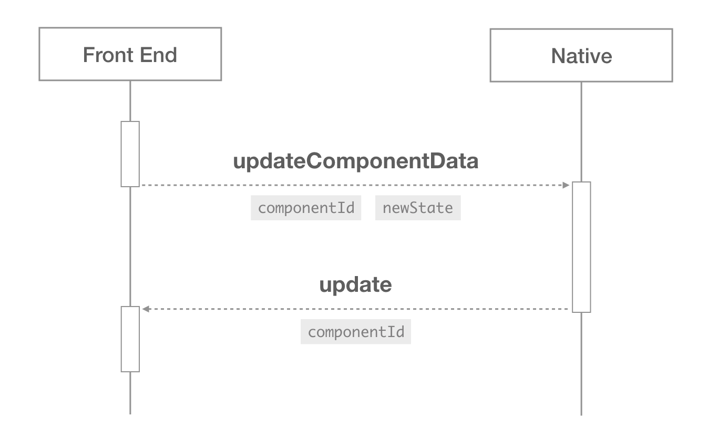

[Readme](./README.md) | [Design](./Design.md)

# 实现细节

这篇文档讲的是 `<recycle-list>` 底层的实现细节。关于前端框架内部和客户端内部的实现机制并未展开，重点介绍的是两端之间如何协调配合的逻辑。

## 模板语法

为了将模板和声明式的渲染逻辑发送给客户端，约定了一些特殊的扩展语法，这些扩展语法目前都是放在组件的属性中的，可以分为【绑定】和【指令】两类，为了和普通属性区分，对属性名做了特殊约定。

+ **绑定** 用于声明数据的取值方式，与渲染内容有关，以 `@` 开头。
+ **指令** 用于声明节点的展开方式，与渲染行为有关，用 `[[]]` 包裹起来。

具体的语法可以分为如下几类：

+ 值绑定： `@binding`
+ 事件绑定： `{ type, params }`
+ 组件声明：
  + `@isComponentRoot`
  + `@templateId`
  + `@componentProps`
+ 条件指令： `[[match]]`
+ 循环指令： `[[repeat]]`
+ 一次性渲染指令： `[[once]]`

目前已经改造了 Vue 的编译工具，能够把 Vue 的常用模板指令编译成上面描述的这些模板语法。

### 值绑定

在模板的属性值和样式值中，使用 `{ "@binding": expression }` 这种语法来表示该值是通过一个表达式计算出来的，属于动态内容，需要在渲染的时候替换成由数据和表达式计算出来的值。这个绑定语法可以出现在对象里，也可以出现在数组里。

例如下面这一小段模板：

```html
<text>{{expression}}</text>
```

最终发送给客户端的是这样的结构：

```js
{
  type: 'text',
  attr: {
    value: { '@binding': 'expression' }
  }
}
```

#### 值的绑定出现在数组里

如果值的绑定出现在数组里，则 map 数组中所有元素，将其中带有 `@binding` 键值的对象视为动态内容，计算出相应的值，然后将其 reduce 成一条数据（默认使用字符串拼接）。

例如下面这一小段模板：

```html
<text>{{who}} only slept for {{count}} hours yesterday.</text>
```

最终发送给客户端的是这样的结构：

```js
{
  type: 'text',
  attr: {
    value: [
      { '@binding': 'who' },
      ' only slept for ',
      { '@binding': 'count' },
      ' hours yesterday.'
    ]
  }
}
```

传入数据后会被渲染成：

```js
// data: [{ who: 'He', count: 'five' }]
[{
  type: 'text',
  attr: {
    value: 'He only slept for five hours yesterday.'
  }
}]
```

#### 值的绑定出现在对象里

如果值的绑定出现在对象里，则将其每一个键值中绑定的 `@binding` 都计算出来。

例如下面这一小段模板：

```html
<text :style="{ fontSize: '15px', color: title.color }"></text>
```

最终发送给客户端的是这样的结构：

```js
{
  type: 'text',
  style: {
    fontSize: '"15px"',
    color: { '@binding':  'title.color' }
  }
}
```

### 事件绑定

如果事件处理函数没绑定参数，则不做特殊处理，和原先的格式一致，只把事件名称的字符串发给客户端；如果绑定了参数，则用一个对象表示，`type` 表示事件的名称，把参数列表编译成带有绑定信息的数组存放在 `params` 属性中。

例如下面这一小段模板：

```html
<div @click="onclick" @appear="onappear(index, item.name)"></div>
```

最终发送给客户端的是这样的结构：

```js
{
  type: 'div',
  event: ['click', {
    type: 'appear',
    params: [
      { '@binding': 'index' },
      { '@binding': 'item.name' }
    ]
  }]
}
```

### 组件声明

前端中的组件最终会展开成节点发送给客户端，客户端并不知道哪些节点会属于同一个组件，需要添加一些标识来声明哪些节点是属于一个前端组件的。

在最终发给客户端的节点中，组件根节点的属性上会带有如下信息：

|      Property      |   Type  | Note |
| ------------------ | ------- | ---- |
| `@isComponentRoot` | Boolean | 必选，用于标记当前节点为某个组件的根节点 |
| `@templateId`      | String  | 必选，组件模板的唯一标识 |
| `@componentProps`  | Object  | 可选，父组件传递给当前组件的绑定信息 |

例如在某个组件用了子组件：

```html
<card :title="item.message"></card>
```

而子组件的定义是这样的：

```html
<!-- card component -->
<template recyclable>
  <text>{{title}}</text>
</template>
```

最终发送给客户端的将会是这样的结构：

```js
{
  type: 'text',
  attr: {
    '@isComponentRoot': true,
    '@templateId': 'virtual-component-template-1',
    '@componentProps': {
      title: { '@binding': 'item.message' }
    },
    value: { '@binding': 'title' }
  }
}
```

在模板中多处使用同一个组件，每一处的组件对应的 `@templateId` 都不一样，`@componentProps` 也很可能不一样。

### 条件指令

在模板中，使用 `[[match]]` 作为条件指令，添加在节点的属性中，属性值是可以计算出真假值的表达式字符串。如果根据该表达式计算出来的值为 falsy，则不渲染该节点，也不渲染其后代节点。

Vue 中的 `v-if` 、`v-else` 和 `v-else-if` 指令都将会被编译成一个表达式字符串，添加到节点的 `[[match]]` 属性中。

例如下面这一小段模板：

```html
<div v-if="x > 5"></div>
<div v-else-if="y < 3"></div>
<div v-else></div>
```

最终发送给客户端的是这样的结构：

```js
[{
  type: 'div',
  attr: {
    '[[match]]': 'x > 5'
    }
  }
}, {
  type: 'div',
  attr: {
    '[[match]]': '!(x > 5) && (y < 3)'
    }
  }
}, {
  type: 'div',
  attr: {
    '[[match]]': '!(x > 5 || y < 3)'
    }
  }
}]
```

### 循环指令

在模板中，使用 `[[repeat]]` 作为循环指令，包含了三个字段，添加在节点的属性中。

|    Property   |  Type  | Note |
| ------------- | ------ | ---- |
| `@expression` | String | 必选，待展开的表达式 |
| `@alias`      | String | 必选，每一项的别名 |
| `@index`      | String | 可选，下标的变量名 |

为了便于使用，在上层可以使用 `alias in expression` 和 `(alias, index) in expression` 这两种简写形式描述一个循环指令。

Vue 中的 `v-for` 指令对应的表达式将会被编译成一个特定格式的对象，添加到节点的 `[[repeat]]` 属性中。

例如下面这一小段模板：

```html
<div v-for="(item, i) in data.panels"></div>
```

最终发送给客户端的是这样的结构：

```js
{
  type: 'div',
  attr: {
    '[[repeat]]': {
      '@expression': 'data.panels',
      '@alias': 'item',
      '@index': 'i'
    }
  }
}
```

### 一次性渲染指令

如果模板中包含 `v-once` 指令，则会在节点的属性中添加 `[[once]]`，表示该节点及其后代节点只会渲染一次，数据改变时也不会更新。

例如下面这一小段模板：

```html
<div v-once></div>
```

最终发送给客户端的是这样的结构：

```js
{
  type: 'div',
  attr: {
    '[[once]]': true
  }
}
```

### 支持的表达式

上述语法中多次提到 **表达式**（expression），它指明了某个指令所绑定的值，如 `{ '@binding': '(a.count + 3) * 0.8' }` 中 `(a.count + 3) * 0.8` 就是一个表达式。这些表达式会以字符串的格式原样发给客户端，由客户端负责解析。

由于环境差异无法支持所有 js 语法，客户端将逐步支持各种操作符，首先支持：

+ [x] 成员运算符：`.` `[]`
+ [x] 分组运算符：`()`
+ [x] 算术运算符：`+` `-` `*` `/` `%` (包括一元运算符 `+` 和 `-`)
+ [x] 比较运算符：`>` `<` `>=` `<=` `===` `!==` (仅支持严格相等或不等，不支持 `==` `!=`)
+ [x] 逻辑运算符：`!` `&&` `||`
+ [x] 条件运算符： `? :`

以后会考虑支持下边的运算符：

+ [ ] 位运算符：`&` `|` `^` `~` `>>` `<<` (不支持补位 `>>>`)
+ [ ] 其他： `typeof` `in` `instanceof`

表达式在运算时不能修改自身或者其他变量的值，要求是没有副作用的“纯”运算，也没有作用域的概念，所以不支持下列运算符：

+ 属性相关：`this` `new` `delete`
+ 赋值： `=` `+=` `-=` `*=` `/=` `%=` `<<=` `>>=` `&=` `^=` `|=`
+ 自增自减： `++` `--`
+ 函数表达式、函数调用

> 客户端只考虑支持单条表达式（Expression），不支持逗号和分号隔开的多个表达式，也不支持语句（Statement）和声明（Declaration）。

#### 表达式中值的类型

为了简化处理，对表达式中的值类型做了一些限制：

+ 变量名：只能用数字、字母下划线和 `$`，不能用其他复杂 unicode 字符，不能以数字开头。
+ 字符串：可以用单引号 `'` 和双引号 `"` 括起来，支持转义字符，不支持 `\u` 的 unicode 编码。
+ 数字：支持整数和 IEEE 754 浮点数，支持使用科学计数法 `e`，不支持 `NaN` 和 `Infinity`，不支持十六进制和八进制。

## 渲染过程



0. 前端在渲染模板时构建 Virtual Component Template，监听客户端发送的 `componentHook`，不触发生命周期，并且阻塞掉列表数据导致的更新。
0. 向组件根节点标记 `@isComponentRoot`，并且生成 `@templateId` 和 `@componentProps` 加入根节点属性中。
0. 将整个列表模板和初始数据一起（append tree 模式），以和渲染正常节点一样的方式发送给客户端。
0. 客户端拿到模板和数据后，由数据驱动模板渲染，回收离屏节点，复用模板结构。

### 模板匹配

在 `<recycle-list>` 中传递了 `switch` 属性，指明了使用数据项中的哪个字段来匹配模板的类型。在 `<cell-slot>` 中传递了 `case` 或者 `default` 属性，指明了当前模板对应的类型值。

在渲染过程中，遍历列表数据中每一项的值，基于 `switch` 的属性值计算出当前数据对应的模板类型，然后依次匹配每个模板中 `case` 对应的值，一条数据只能对应一个模板，没有匹配到则使用带有 `default` 属性的模板。如果没匹配到任何模板，则忽略这一条数据。

### 取值作用域

变量名以就近原则从列表数据中计算真实值。在一个循环体里 `[[repeat]]` 属性中 `@alias` 和 `@index` 对应的变量名可以覆盖列表数据中的变量名。
组件是独立作用域，只从自身的组件数据中取值，每个 `componentId` 对应一份，不从列表数据中取值。

### 渲染子组件

在渲染过程中，如果遇到某个节点包含了 `@isComponentRoot` 属性，则将当前节点及其后代节点视为一个组件。



0. 首先在客户端中生成一个全局唯一的 `componentId`，作为组件的唯一标识符。
0. 计算组件根节点 `@componentProps` 中定义的绑定信息，生成 `propsData`。
0. 通过 `componentHook` 派发 `create` 的钩子，将 `componentId` 和 `propsData` 发送给前端。
0. 前端中以 `componentId` 和 `propsData` 为初始参数创建 Virtual Component，计算组件的初始状态 `initialState` 并同步返回给客户端。
0. 在前端中触发 Virtual Component 的 `beforeCreate` 和 `created` 生命周期。
0. 客户端使用 `initialState` 中的数据渲染当前组件中的模板，渲染完成后派发 `attach` 的钩子给前端。
0. 在前端中触发 Virtual Component 的 `beforeMount` 和 `mounted` 生命周期。

如果渲染组件的过程中又遇到了包含 `@isComponentRoot` 的节点，则表示又遇到了子组件，重复上述渲染过程。

## 响应事件



当在某个节点上捕获到事件时，

0. 首先找到触发事件的节点对应的 `componentId`，如果找到了则向事件对象 `event` 中添加该属性。
0. 如果事件的定义中包含了参数的绑定信息 `params`，则计算出绑定的参数值，在 `fireEvent` 的时候一起派发给前端。
0. 前端中由 Virtual Component Template 接收到事件，根据 `componentId` 找到指定的 Virtual Component，将事件对象和参数派发给相应的事件处理函数。

## 更新列表数据

列表数据在使用时很可能会被更新，在前端框架里监听了列表数据的常用操作，会同时触发 `<recycle-list>` 提供的原生方法（component method）将数据更新同步给客户端。


|     Method    |               Arguments              | Return | Note |
| ------------- | ------------------------------------ | ------ | ---- |
| `appendData`  | `(item: any)`                        | void   | 向列表结尾添加一条数据 |
| `appendRange` | `(range: Array<any>)`                | void   | 向列表结尾添加一组数据 |
| `insertData`  | `(index: Number, item: any)`         | void   | 在列表的指定位置插入一条数据 |
| `insertRange` | `(index: Number, range: Array<any>)` | void   | 在列表的指定位置插入一组数据 |
| `updateData`  | `(index: Number, item: any)`         | void   | 更新列表的某一项数据 |
| `removeData`  | `(index: Number, count: Number)`     | void   | 从某个位置开始，删除指定条数的数据 |
| `setListData` | `(newListData: Array<any>)`          | void   | 重新设置整个列表的数据 |

新的数据将会导致页面的重新渲染，其中很可能会触发子组件的创建、更新和删除。

### 创建新组件

如果在更新列表数据时，需要创建某些子组件，整个过程和初次渲染子组件的过程是一样的。

应该生成新的 `componentId` 并计算 `propsData`，然后通过 `create` 的钩子发给前端，前端创建 Virtual Component 并返回 `initialState`，然后客户端用这个数据渲染组件中的模板。

### 更新组件

在更新列表数据时，如果对应的列表模板中包含组件，应该触发组件的更新流程。



0. 以修改了某条数据为例，如果某一项列表数据的内容发生了修改，则会触发 `updateData` 操作，把下标 `index` 和新的列表项数据 `itemData` 发送给客户端。
0. 如果更新列表数据项的时候遇到了组件，则找到组件对应的 `componentId`，先根据 `@componentProps` 中的绑定信息计算出 `newPropsData`。
0. 将 `newPropsData` 和最初生成的 `propsData` 做对比，如果存在差异，则将差异数据和 `componentId` 一起通过 `syncState` 的钩子发送给前端。
0. 前端框架中重新计算 Virtual Component 的状态，如果数据有变动，则将新状态 `newState` 同步返回给客户端，并且触发 `beforeUpdate` 生命周期。
0. 客户端根据 `newState` 渲染组件中的模板，并且用 `newPropsData` 替换旧的 `propsData`。
0. 真实节点渲染完成后，通过 `componentHook` 向前端派发 `update` 的钩子。
0. 在前端中触发 Virtual Component 的 `updated` 生命周期。

### 移除组件

如果列表数据的变更导致某些节点被移除掉了，应当检测被移除掉的节点中是否包含组件（是否包含 `@isComponentRoot`），如果包含组件则执行组件移除的逻辑。



0. 以删除列表数据为例，在前端中使用 `shift` 、 `pop` 、 `splice` 修改了列表数据时，都会触发 `removeData` 操作，把开始删除的下标 `index` 和删除的个数 `count` 发给客户端。
0. 在客户端中首先要找到被移除节点对应的 `componentId`，清除相应的组件数据并回收相应的模板。
0. 然后通过 `componentHook` 向前端派发 `detach` 的钩子，把 `componentId` 发送给前端。
0. 在前端中触发 Virtual Component 的 `beforeDestroy` 和 `destroyed` 生命周期。

不止是在删除一条列表数据的时候才删除组件，如果修改了某条数据导致 `[[match]]` 不匹配，或者 `[[repeat]]` 遍历的数据变少了，也可能会触发组件的删除逻辑。

## 更新组件的内部状态



在前端框架中，除了列表数据以外，每个组件都可能会有独立的内部状态，当 Virtual Component 的内部状态发生变化之后，会主动触发数据的更新。

0. 前端框架中如果监听到 Virtual Component 的状态有变化，则计算出 `newState` 并且触发 `beforeUpdate` 的生命周期。
0. 然后使用 `updateComponentData` 方法将 `componentId` 和 `newState` 发送给客户端。
0. 客户端根据 `componentId` 找到相应的组件，使用 `newState` 重新渲染组件中的模板。
0. 真实节点渲染完成后，通过 `componentHook` 向前端派发 `update` 的钩子。
0. 在前端框架中触发 Virtual Component 的 `updated` 生命周期。

## 更新模板结构

副作用太多，暂不支持。

模板的结构和源码里的标签结构基本上是一一对应的，包含了渲染逻辑，模板指令也编译成了静态属性，一般不需要更新。

## Ref 支持

为了模拟 ref，Native 端提供了VirtalElement 结构，调用`this.$refs.refName`以后会返回如下结构的对象：

```typescript
declare type WeexVirtalElement = {
  attrs: Object;
  type: string;
  ref: string;
  '[[VirtualElement]]': true;
}
```

在`<recycle-list>`事件和子组件生命周期中，Native 会向前端返回 ref 结构映射：

```typescript
declare type WeexComponentHookInstance = {
  virtualComponentId?: string; // <recycle-list>事件中不传入
  position: number;
  refs: {
    [string]: Array<WeexVirtalElement>
  }
}
```

### `<recycle-list>`事件

在 `<recycle-list>`上会默认添加以下两个事件监听：

* _attach_slot：每个cell-slot载入或者更新时触发，传入需要更新的 ref 结构映射
* _detach_slot：每个cell-slot回收触发，传入需要删除的 ref 结构映射

特殊情况：如果cell-slot中有用 v-for，那么返回的 ref 是一个`length > 1`的数组，并且其他cell-slot中不能使用这个ref（前端约定），[例子](http://dotwe.org/vue/4989a3b18bbefd1e9d845b7fc6e6b09c)

### 子组件生命周期

通过`registerComponentHook`添加子组件生命周期的监听：

* attach：子组件挂载的时候触发，传入需要添加的 ref 结构映射
* update：子组件更新的时候触发，传入需要更新的 ref 结构映射
* detach：子组件被销毁的时候触发，传入需要删除的 ref 结构映射
