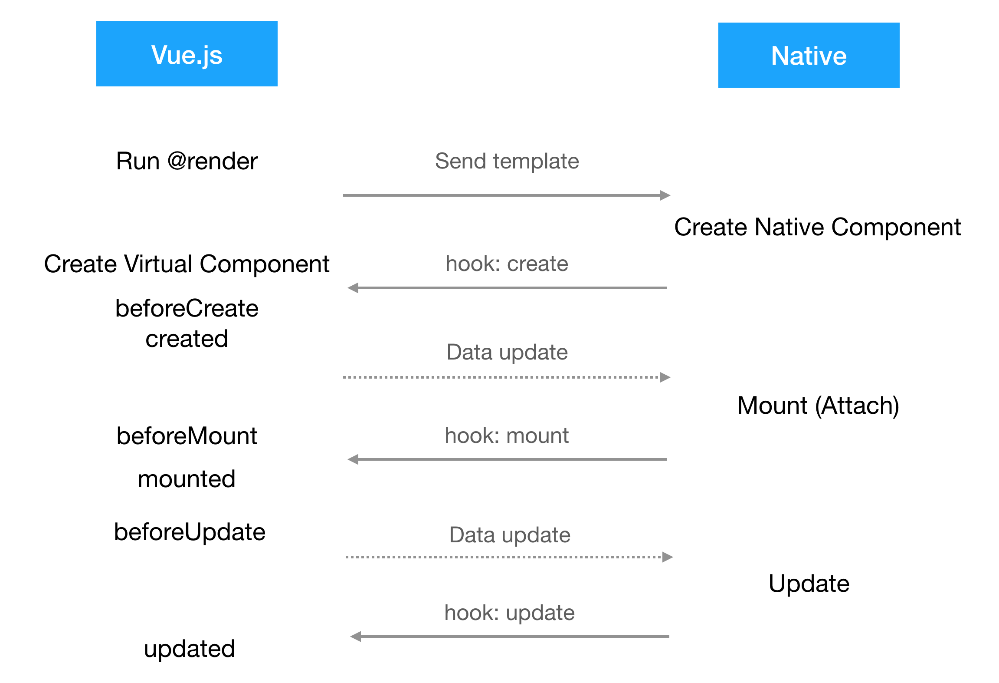

# 使用子组件

在模板中使用的子组件将会有一些语法限制。

## 属性传递

+ 在子组件的根节点上添加 `@isComponentRoot` 属性，并设置为 `true`，表明这是节点是由某个组件的根节点。
+ 将子组件所接受的 props 及其绑定信息添加到根节点的 `@componentProps` 属性中。

假如说 banner 组件的定义如下：

```js
Vue.component('banner', {
  props: ['title'],
  template: `<text>[------- {{title}} -------]</text>`
})
```

在 `<cell-slot>` 中用到了 banner 组件：

```html
<cell-slot>
  <banner title="item.title"></banner>
</cell-slot>
```

实际上 banner 组件应该编译成如下结果：

```js
// <cell-slot> 中 <banner> 组件的编译结果
h('cell-slot', {}, [
  h('banner', {
    attrs: {
      title: { '@binding': 'item.title' }
    }
  })
])

// banner 组件自身的编译结果
Vue.component('banner', {
  props: ['title'],
  render (h) {
    return h('text', {
      attrs: {
        '@isComponentRoot': true,
        '@componentProps': {
          title: this.title
        },
        value: ['[------- ', { '@binding': 'title' }, ' -------]']
      }
    })
  }
})
```

最终发到客户端的数据是：

```js
{
  type: 'cell-slot',
  children: [{
    type: 'text',
    attr: {
      '@isComponentRoot': true,
      '@componentProps': {
        title: { '@binding': 'item.title' }
      },
      value: ['[------- ', { '@binding': 'title' }, ' -------]']
    }
  }]
}
```

## 生命周期

由于渲染行为发生了改变，生命周期的含义也发生了变化，不同的前端框架、不同客户端中组件的生命周期也都不一样。为了最小化这些差异，以 `<recycle-list>` 本身的渲染行为为参考，取平台和框架的交集，将组件的生命周期做了简化：

+ `create`: 在原生列表元素被创建后触发。
+ `attach`: 在列表元素添加页面后触发。
+ `update`: 列表更新后时触发。
+ `detach`: 列表元素即将销毁时触发。

生命周期对应表：

|   | directive |       Vue     |           Rax             |  Android  |      iOS      |
| - | --------- | ------------- | ------------------------- | -         | -             |
|   | create    | beforeCreate  | constructor               | ------    | -             |
| * | create    | created       | -                         | onMeasure | -             |
|   | attach    | beforeMount   | componentWillMount        | onDraw    | loadView      |
| * | attach    | mounted       | componentDidMount         | attached  | viewDidLoad   |
|   | -         | -             | componentWillReceiveProps | -         | -             |
|   | -         | -             | shouldComponentUpdate     | -         | -             |
|   | update    | beforeUpdate  | componentWillUpdate       | -         | -             |
| * | update    | updated       | componentDidUpdate        | -         | -             |
| * | detach    | beforeDestroy | componentWillUnmount      | detached  | viewDidUnload |
|   | detach    | destroyed     | -                         | -         | -             |

> Android 和 iOS 组件的生命周期未列全。

主要差异点是：

+ `beforeCreate` 和 `created` 生命周期将在模板发送到客户端以后，节点开始渲染之前，才逐个触发。
+ `beforeMount` 和 `mounted` 将会延迟触发，因为列表中的节点是重复利用的，只有即将滚动到该节点的时候才会渲染，而且此时节点是复用了之前的模板，只是更新了其中都数据，并没有重新创建、挂载。
+ `beforeDestroy` 和 `destroyed` 生命周期将在 `<recycle-list>` 组件销毁时批量触发。

## 内部状态管理

### Virtual Component

Virtual Component 是指没有对应的 Virtual DOM、只用于管理内部状态的虚拟组件。默认将包含了 `@render` 函数的组件都视为 Virtual Component。

### 对编译工具的改造

+ 编译 `<recycle-list>` 的时候，给其中的子组件挂上 `@inRecycleList` 属性，包含此属性的子组件将额外生成 `@render` 函数，用于发送模板。
+ 在 `@render` 中，将数据绑定和渲染指令编译成和 `<recycle-list>` 相同的语法。
+ 在 `@render` 中，给子组件的根节点额外添加几条属性：
  + `@isComponentRoot`: {Boolean} 用于标记当前节点为某个组件的根节点。便于客户端划分变量名的作用域。
  + `@componentProps`: {Object} 父组件使用当前组件时，给每条属性传递的绑定信息。

## 详细渲染过程



### 1. 渲染页面

+ 1.1 从入口组件根节点开始渲染页面，遇到 `<recycle-list>` 时，则 "appendAsTree"，等所有子节点都生成好后再发给客户端。
+ 1.2 校验 `<recycle-list>` 的子节点，只支持使用 `<cell-slot>`。其中的数据绑定和指令的语法会被转成原生渲染指令，存在属性中发给客户端。
+ 1.3 渲染 `<cell-slot>` 中的节点，在其中遇到子组件时，如果该组件
  + 支持当做模板来渲染（包含 `@render`），则执行 2 创建组件的模板实例。
  + 不支持当做模板来渲染，则提示错误，并尝试使用正常方式渲染。
+ 1.4 将生成的模板和列表的数据发送给客户端，客户端执行 3。
+ 1.5 当列表数据有更新时。(TODO)
+ 1.6 当列表中的节点派发了事件时。(TODO)

### 2. 创建组件模板实例

+ 2.1 生成唯一的组件模板 id，创建 Virtual Component Template。
+ 2.2 阻塞自身的状态和生命周期，监听原生事件，不再绑定 render 和 update。
+ 2.3 注册原生 *create* 生命周期的钩子，在其中执行创建 Virtual Component 的逻辑，即 4。
+ 2.4 执行 `@render` 函数生成组件的模板，在组件根节点上会添加 `@componentTemplateId` 和 `@componentProps` 属性，分别指定当前组件模板的 id 和传递给组件属性值的绑定信息。
  + 如果过程中又遇到子组件，则执行 2 创建新的组件的模板实例。
  + 然后将模板的渲染结果挂载到父节点中。
+ 2.5 如果模板实例接收到了客户端派发的事件，根据 componentId 找到相应的虚拟组件，并且派发虚拟组件的事件，执行其事件处理函数。如果触发了数据更新，则执行 4.5。

### 3. 客户端接收到模板和数据

+ 3.1 客户端存储 `<cell-slot>` 的模板和列表数据，然后遍历数据，根据数据中指定的模板类型，渲染相应的 `<cell-slot>` 模板。
+ 3.2 解析模板中添加的原生渲染指令和数据绑定的信息，根据数据生成真实的节点，并绘制原生 UI 模板。
+ 3.3 在解析过程中遇到某节点为组件的跟节点时，则生成唯一的 componentId，创建新的取值作用域，计算出 `@componentProps` 中绑定的初始数据（propsData），并且触发由 `@componentTemplateId` 指定的组件模板的 *create* 生命周期，将 componentId 和 propsData 传递过去。前端框架中执行 4。
+ 3.4 接受到组件发送的初始数据后，根据 componentId 将其存储在列表数据中（或者单独存储）。
+ 3.5 当客户端接收到数据更新的指令时，根据 componentId 找到现有的组件状态数据，执行 merge 和 diff，根据比对结果重新渲染。更新结束后派发原生的 *update* 生命周期，前端执行 4.3.2。
+ 3.6 当某个节点触发了事件时，找到该节点所属的 `componentId` 和 `@componentTemplateId`，如果
  + 找到了，则连同事件对象和事件处理函数的参数一起发送给前端中的模板实例。前端框架执行 2.5。
  + 没找到。(TODO)

### 4. 创建虚拟组件

+ 4.1 根据 componentId 和 propsData 创建虚拟组件，初始化自身状态和生命周期，不直接监听原生派发的事件。
+ 4.2 依次派发前端框架中的 *beforeCreate* 和 *created* 生命周期。
+ 4.3 注册原生的 *attach* 、 *update* 、 *detach* 生命周期钩子。
  + 4.3.1 当客户端派发 *attach* 时，先派发前端框架中的 *beforeMount* 生命周期，然后绑定 Watcher 监听内部状态数据，派发前端框架中的 *mounted* 生命周期，如果数据有更新则触发 4.5。
  + 4.3.2 当客户端派发 *update* 时，派发前端框架中的 *updated* 生命周期。
  + 4.3.3 当客户端派发 *detach* 时，依次派发前端框架中的 *beforeDestroy* 和 *destroyed* 生命周期。
+ 4.4 取出组件初始化的数据，和 componentId 一起发送给客户端。客户端执行 3.4。
+ 4.5 如果虚拟组件中触发了数据更新，先执行 *beforeUpdate* 的生命周期，不再触发重新渲染，而是将 componentId 和新数据一起发送给客户端。客户端执行 3.5。

## 例子

仓库的 [README.md](../README.md#%E4%BE%8B%E5%AD%90) 中有例子。
